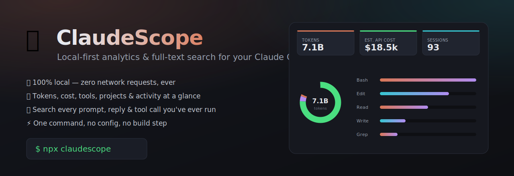

<div align="center">



# 🔭 ClaudeScope

**Full-text search across every Claude Code session you've ever run — in your browser, with zero install and zero network. Plus the usage dashboard your subscription doesn't show you.**

[](test/)
[](https://www.npmjs.com/package/claudescope-cli)
[](https://nodejs.org)
[](LICENSE)
[](package.json)
[](#-privacy-first)

```bash
npx claudescope-cli
```

*That's it. No install, no config, no account, no network. Your browser opens a dashboard built entirely from the transcripts already on your disk.*

<br/>


<sub>▶ <a href="docs/promo.mp4">Watch the 20-second tour (MP4)</a></sub>

<br/>

<sub>⭐ <b>Useful? <a href="https://github.com/JoniMartin27/claudescope">Star it</a></b> — it's the fastest way to help. Found a bug or want a feature? <a href="https://github.com/JoniMartin27/claudescope/issues">Open an issue</a>.</sub>

</div>

---

## The problem

You solved this exact bug with Claude Code three weeks ago. **Which session was it in?** `claude --resume` shows you a wall of session IDs and timestamps — no content, no cross-project search. Your answer is sitting right there in `~/.claude/projects/`, locked inside **gigabytes of raw `.jsonl`** you can't grep.

ClaudeScope gives you **instant full-text search across every prompt, reply and tool call** you've ever run — and a session viewer to actually read the one you found. It also surfaces the usage you can't otherwise see:

- 🔎 *"Find the session where I set up the Postgres driver"* — search content, jump in, read it.
- 💸 *How many tokens am I burning, and what would caching have cost me?*
- 🗂️ *Which projects eat the most of my Claude time?*
- 🛠️ *Which tools does Claude lean on, and where did it go the wrong way?*
- ⏰ *When am I most productive with it?*

All of it from the transcripts already on your disk — **100% local, zero network**, one command.

## What you get

| | |
|---|---|
| 🔎 **Full-text search** | Instantly grep every prompt, reply and **tool-call input** across all sessions, with highlighting — filter by role/project. |
| 📖 **Session viewer** | Click any result to read the full conversation — prompts, replies, tool calls — in place. |
| 🗓️ **Date-range filter** | Scope the whole dashboard to the last 7 / 30 / 90 days, or all time. |
| 📊 **Usage at a glance** | Sessions, messages, tokens, estimated API-equivalent cost, and **how much caching saved you**. |
| 🍩 **Token mix & model spend** | Where your tokens go (hint: mostly cache) and cost per model. |
| 🧭 **Typical session** | Median / p90 cost, messages and duration — plus interrupted-session detection. |
| 🔥 **Activity heatmap & timeline** | Your rhythm by weekday × hour, and daily trend by cost **or** tokens. |
| 🧠 **Insights & archetype** | Plain-language one-liners about your habits, plus a coding archetype derived from your patterns. |
| 📈 **Momentum & streaks** | Week-over-week trend and active-day streaks. |
| 🪄 **Wrapped share card** | A shareable, **anonymized** year-in-review — generated entirely in your browser. |
| 🔌 **Multi-CLI** | Also picks up your **Codex, Cursor, Aider, Gemini & Copilot CLI** logs when present — search across all your agents (Claude Code is the reference; others are best-effort). |
| 🏆 **Percentile badge** | A rough, **100% offline** "top X% of token users" estimate, also on your Wrapped card. |
| 📱 **Installable PWA** | Install it as a standalone app on desktop or your phone; works offline after first load. Plus a compact `/widget.html`. |
| 💵 **Real API cost (opt-in)** | A local relabel toggle, and an **off-by-default** connector to the Anthropic Usage API for your true billed usage. |
| ⬇️ **Export** | One click to a Markdown summary, per-day CSV, or raw JSON. |

## Quick start

```bash
# Run it (Node 18+)
npx claudescope-cli

# Custom port, don't auto-open the browser
npx claudescope-cli --port 4400 --no-open

# Pipe the raw analytics somewhere else
npx claudescope-cli --json > usage.json

# Print a plain-text weekly "Scope Report" and exit (no server, no network)
npx claudescope-cli --weekly

# Point at a non-default location
npx claudescope-cli --dir /path/to/.claude

# Show all flags
npx claudescope-cli --help     # or -h
```

> The npm package is **`claudescope-cli`**; the command it installs is **`claudescope`** (so `npm i -g claudescope-cli` then just `claudescope`).

By default the dashboard opens at **http://127.0.0.1:4317** (override with `--port`). ClaudeScope auto-detects your Claude Code data directory — it honors `CLAUDE_CONFIG_DIR`, then falls back to `~/.claude`, then `$XDG_CONFIG_HOME/claude` and `~/.config/claude`. It reads the transcripts, builds the dashboard in memory, and serves it on `127.0.0.1` only.

### Weekly ritual

`--weekly` prints a concise plain-text **Scope Report** — this-week-vs-last-week deltas (cost, tokens, sessions), your 🔥 streak, archetype, top project, and percentile — computed 100% locally with **no server and no network**. It also records today's snapshot so your streak keeps accruing. Wire it into a scheduler to get a recurring log:

```bash
# macOS / Linux — cron, every Monday at 9am
0 9 * * 1 claudescope --weekly >> ~/scope.log
```

```powershell
# Windows — Task Scheduler (run weekly); the action runs:
claudescope --weekly >> "$HOME\scope.log"
```

The digest is pure ASCII + a couple of emoji accents, so it stays readable when piped to a file.

### Team mode (local, no server)

Want a *team* view — combined usage across several machines or teammates —
without standing up any infrastructure? ClaudeScope merges raw session exports
**entirely on your machine**: no server, no upload, no account. Nobody's
transcripts ever leave their laptop except as a file *they* choose to share.

```bash
# 1) Each person exports their own raw sessions (local, read-only):
claudescope --dump-sessions me.json

# 2) Everyone drops their me.json into a shared folder
#    (Google Drive, Dropbox, a network share, a git repo — your call),
#    renamed so they don't collide, e.g. ./team/alice.json, ./team/bob.json

# 3) Anyone merges the whole folder into one combined dashboard payload:
claudescope --merge ./team

# …or pass explicit files, and/or write the result out:
claudescope --merge alice.json bob.json --output team-usage.json
```

`--dump-sessions <file>` writes the **raw normalized sessions array** — the exact
input to the analytics engine. That's the shareable unit, because the analytics
output is already aggregated and lossy and can't be re-merged faithfully. Each
session is tagged with its origin (your hostname, or `--label <name>`).

`--merge <paths…>` reads one or more dump files (and/or recurses folders for
`*.json` that look like dumps), concatenates the sessions, runs analytics over
the combined set, and prints the merged JSON (or writes it with `--output`).
Bad or non-matching files are **skipped with a note on stderr**, so a stray
README or a half-written file never breaks the merge. Provenance is preserved
per session, so a future UI can break the combined view down by source.

Both flags are **100% local** — like everything else in ClaudeScope, they make
zero network requests.

## 🔒 Privacy first

This is the whole point:

- **Zero network requests.** ClaudeScope never phones home, never uploads, never analytics-pings. Disconnect your Wi-Fi and it works identically.
- **Read-only.** It only ever *reads* your transcript files. It never modifies or deletes them.
- **Local-only server.** Binds to `127.0.0.1` — not reachable from your network.
- **Zero runtime dependencies.** Pure Node.js standard library. Nothing in `node_modules` to audit. [Read every line](src/) in five minutes.

Your AI coding history is some of the most sensitive data you own. It should never leave your machine to be understood — so it doesn't.

## Install it as an app

ClaudeScope is an installable **PWA**. Open the dashboard, then:

- **Desktop:** click your browser's **Install** button (the ⊕ / install icon in
  the address bar) to launch ClaudeScope in its own standalone window.
- **Mobile:** open the URL in your phone's browser and choose **Add to Home
  Screen**.

It registers an offline service worker, so the app shell loads even with no
network — still 100% local, still zero phone-home. Want something smaller? The
compact **`/widget.html`** view shows just the key stat cards, ideal for a
pinned mini-window or a home-screen shortcut.

## See it on your phone

By default ClaudeScope binds to `127.0.0.1`, so it's only reachable from the
machine it runs on. To open it on your phone (on the same Wi-Fi), bind to your
LAN address explicitly:

```bash
npx claudescope-cli --host 0.0.0.0
```

It prints the LAN URL to open on your phone, e.g. `http://192.168.1.42:4317`.

> ⚠️ **Loud privacy caveat.** `--host 0.0.0.0` (or any non-loopback host)
> exposes your **entire Claude Code history to everyone on the same network** —
> no auth, no password. Only use it on a network you trust, and stop the server
> when you're done. The default `127.0.0.1` bind never leaves your machine.

## Real API cost

Most users are on a flat-rate plan, so the dashboard's dollar figures are an
**estimate** at list API rates (see below). Two extras let you sharpen that:

- **API-cost mode** — a toggle in the settings popover that relabels the
  estimate as your "API cost at list rates." It's purely cosmetic, stored in
  your browser's `localStorage`; it changes no numbers and makes no requests.
- **Anthropic Usage API connector (opt-in, off by default)** — to pull your
  *real* billed usage, set an admin key and click the connector button:

  ```bash
  ANTHROPIC_ADMIN_KEY=sk-ant-admin-... npx claudescope-cli
  ```

  Without that env var the feature stays dormant. It only ever fires on an
  **explicit click** (`/api/anthropic-usage`) — the default dashboard still
  makes **zero** network requests.

## Share your Wrapped card

**ClaudeScope Wrapped** turns your usage into a shareable year-in-review card.
It's **anonymized** — no project names, no prompts, no content — and generated
**entirely in your browser**. Nothing is uploaded; you get an image to share if
*you* choose to.

## About the cost numbers

Most Claude Code users are on a flat-rate **Max** or **Pro** subscription, so the dollar figures are **not a bill**. They estimate what your token volume *would* cost on the pay-as-you-go Anthropic API at list prices — a relative gauge of intensity, not money spent. Cache reads and writes are priced with Anthropic's published multipliers (0.1× and 1.25× the input rate).

## How it works

```
~/.claude/projects/<encoded-path>/<session>.jsonl
        │
        ▼
   src/parser.js     ← streams each transcript line-by-line (handles 50k-line files,
        │              tolerates malformed lines, extracts model/usage/tools/text)
        ▼
  src/analytics.js   ← aggregates totals, projects, models, tools, days, heatmap
        │
        ▼
   src/server.js     ← tiny stdlib HTTP server: /api/analytics, /api/search
        │
        ▼
     public/         ← dependency-free dashboard (vanilla JS + SVG charts)
```

No framework, no bundler, no database. It parses ~35k messages in well under two seconds.

## Roadmap

- [x] Session detail view (full conversation replay)
- [x] Export a shareable, anonymized usage card (ClaudeScope Wrapped)
- [x] Diff usage between date ranges
- [x] Per-day token/cost CSV export
- [x] Installable PWA + offline service worker
- [ ] Support for other agent CLIs that log JSONL

Ideas and PRs welcome — see [the issues](https://github.com/JoniMartin27/claudescope/issues).

## Contributing

```bash
git clone https://github.com/JoniMartin27/claudescope
cd claudescope
node --test          # run the test suite (zero install needed)
npm start            # launch the dashboard against your own data
```

The codebase is deliberately tiny and dependency-free. If you add a feature, add a test for it. See [`CONTRIBUTING.md`](CONTRIBUTING.md) for the rules.

**Extending ClaudeScope** — to add support for another agent CLI's logs or a custom dashboard panel, see [`docs/EXTENDING.md`](docs/EXTENDING.md): it documents the `src/sources/` adapter contract, the normalized session/message shape, and how analytics fields reach the dashboard (with a copy-paste adapter skeleton).

## License

[MIT](LICENSE) © [Joni Martin](https://github.com/JoniMartin27)

<div align="center">

**If ClaudeScope showed you something surprising about your own usage, give it a ⭐ — it genuinely helps other Claude Code users find it.**

</div>
